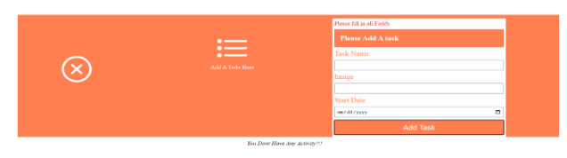
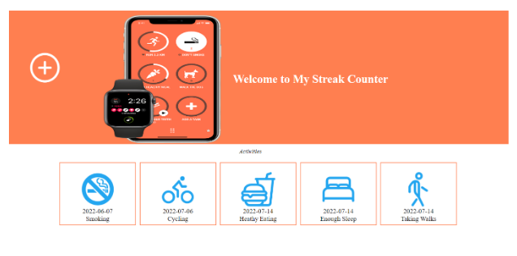
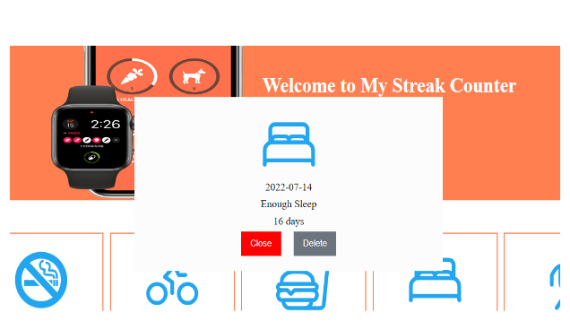

# Streak Counter

- We are Going to Build a Simple streak Counter. A streak Counter is a tracker for Good Habit.
- For Example, if I Stop smoking today, I want to add that as an activity an in future, like next month I can see how many days have gone without me smoking.

### Below is a Guide to follow: On Page Load the page should look like This

- On Close Go Back to the First Frame
- Adding a Streak by filling in a Name an image (URL) and a start date.
- On Validation Display a Message on the DOM that disappears after 5 seconds

- The message saying no Activities added yet on add should be Activities
- On Adding Several Activities, The UI should look like this or Better

- Add a Functionality to View a Streak by displaying a Pop Up

- On Close, Close the Pop Up
- Delete, Delete the Activity

#### what to add
- Add a best streak Feature That Shows the activity with the best streak next to the header.

#### Use the following
    •Arrays no Local Storage and should be private 
    •Three or More Classes•At least one static method
    •Strong Typing•Interfaces, Have all interfaces on their one Folder.
    •Readable Code 
    •The Functionality to calculate days of the streak should be in its own class, Same for the functionality to Show the best Streak

